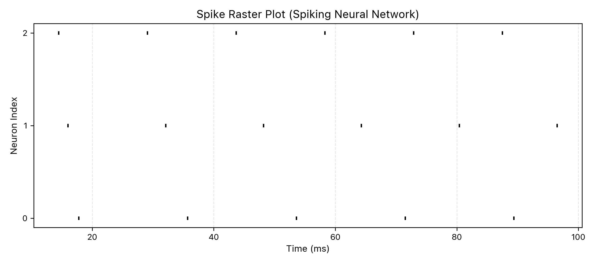
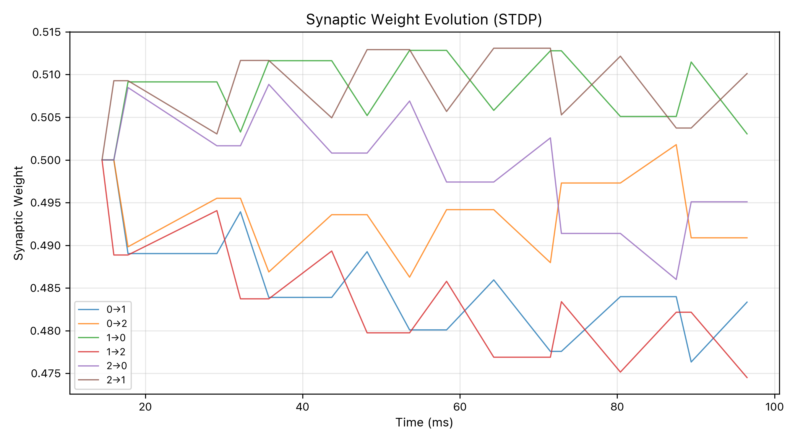

# Neuromorphic AI Research-Style Prototype

## 1. What Is Neuromorphic Computing?

Neuromorphic computing is an alternative paradigm to conventional artificial intelligence that takes inspiration from the structure and dynamics of biological neural systems. Instead of relying on continuous-valued activations, global clocks, and gradient-based backpropagation, neuromorphic systems operate using discrete spike events, local learning rules, and time-driven dynamics. Information is encoded in the timing and frequency of spikes, and computation emerges from interactions between neurons and synapses rather than from centralized optimization. This approach is considered promising for future AI systems due to its potential for energy efficiency, real-time responsiveness, robustness, and closer alignment with how intelligence appears to arise in biological brains. [1][2][3]

## 2. Project Overview and Experimental Design

This project implements a research-style neuromorphic simulation pipeline centered around a spiking neural network with Spike-Timing-Dependent Plasticity (STDP). The core simulation is written in Rust to ensure performance, determinism, and memory safety while modeling neurons, synapses, spike events, and local learning dynamics. A Go-based orchestration layer is used to manage experiment execution, trigger simulations, and verify generated data artifacts. Finally, Python is used for post-processing and visualization, producing spike raster plots and synaptic weight evolution curves. The system is intentionally modular and language-agnostic, mirroring how real-world research and production systems separate simulation engines, experiment control, and analysis tooling. [4][5]

## 3. Results and Key Takeaways

The simulation produces temporally structured spike activity across neurons and demonstrates adaptive synaptic behavior through STDP. Spike raster plots show coherent firing patterns over time, while synaptic weight traces confirm that learning emerges purely from local spike timing interactions without any global error signal. Through this project, I gained a deeper understanding of event-driven computation, biologically inspired learning rules, and the practical challenges of building reproducible research pipelines. Working across Rust, Python, and Go also highlighted the strengths of each language: Rust for safe, high-performance simulation, Python for rapid scientific analysis and visualization, and Go for simple, reliable orchestration of experiments. Equally important, this work reinforced the value of system-level thinking—designing clean interfaces between components and choosing tools based on their strengths rather than forcing a single-language solution.

### Visual Results

**Spike Raster Plot**



**Synaptic Weight Evolution (STDP Learning Dynamics)**



## 4. Algorithms, Equations, and How to Run

Learning is governed by Spike-Timing-Dependent Plasticity, where synaptic weight updates depend on the relative timing between pre- and post-synaptic spikes: [6][7]

If Δt = t_post − t_pre

For Δt > 0 (pre fires before post):
Δw = A_plus * exp(−Δt / tau_plus)

For Δt < 0 (post fires before pre):
Δw = −A_minus * exp(Δt / tau_minus)

All updates are local to each synapse and applied incrementally during the simulation.

### How to Run the Project

#### Run the full experiment pipeline (recommended)

```bash
cd go-orchestrator
go run main.go
```

#### Run components manually (for inspection or development)

**Rust simulation**
```bash
cd rust-core
cargo run
```

**Python analysis**
```bash
cd python-analysis
source .venv/bin/activate
python3 plot_spikes.py
python3 plot_weights.py
```

Generated data is written to `data/raw/`, and visualizations are saved to `results/`.

## References

[1] C. Mead, *Neuromorphic Electronic Systems*, Proceedings of the IEEE, 1990.  
[2] G. Indiveri et al., *Neuromorphic Silicon Neuron Circuits*, Frontiers in Neuroscience, 2011.  
[3] S. Furber, *Large-Scale Neuromorphic Computing Systems*, Journal of Neural Engineering, 2016.  
[4] E. Chicca et al., *A VLSI Recurrent Network of Integrate-and-Fire Neurons*, IEEE Transactions on Circuits and Systems, 2003.  
[5] P. Merolla et al., *A Million Spiking-Neuron Integrated Circuit with a Scalable Communication Network*, Science, 2014.  
[6] G. Bi and M. Poo, *Synaptic Modifications in Cultured Hippocampal Neurons*, Journal of Neuroscience, 1998.  
[7] W. Gerstner et al., *Spiking Neuron Models: Single Neurons, Populations, Plasticity*, Cambridge University Press, 2014.